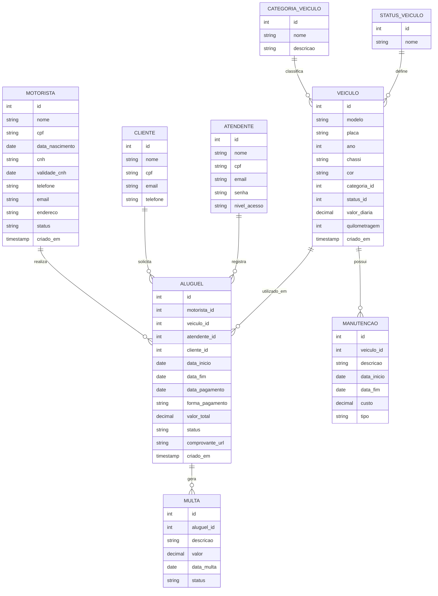

# 🚗 Sistema de Locação de Veículos

## 📋 Apresentação do Projeto

### Tema
Sistema de gerenciamento para locadora de veículos, permitindo o controle completo de motoristas, veículos, aluguéis, manutenções e multas.

### Objetivo Geral
Desenvolver um banco de dados relacional para gerenciar as operações de uma locadora de veículos, incluindo cadastro de motoristas, controle de frota, registro de aluguéis, manutenções e multas, garantindo a integridade e consistência dos dados.

### Público-Alvo
- Administradores de locadoras de veículos
- Atendentes e operadores do sistema
- Gerentes de frota
- Clientes que alugam veículos

---

## 📊 Modelo de Dados Relacional



## 🔒 Regras de Integridade e Estrutura do Banco

O banco de dados foi projetado com foco em **integridade, consistência e boas práticas**, utilizando constraints avançadas do PostgreSQL.

---

### 🧠 Regras Aplicadas

* 🔑 **Primary Key (PK):** Identificador único em todas as tabelas
* 🔗 **Foreign Key (FK):** Garantia de relacionamento válido entre tabelas
* ⚠️ **NOT NULL:** Campos obrigatórios
* 🔁 **UNIQUE:** Evita duplicidade (CPF, email, placa, chassi)
* ✅ **CHECK:** Validação de regras de negócio
* ⚙️ **DEFAULT:** Valores automáticos
* 🔄 **ON DELETE CASCADE / RESTRICT:** Controle de exclusão

---

## 🧱 Script SQL Completo

```sql
-- =========================
-- TABELAS AUXILIARES
-- =========================

CREATE TABLE IF NOT EXISTS categoria_veiculo (
    id SERIAL PRIMARY KEY,
    nome VARCHAR(100) NOT NULL UNIQUE,
    descricao TEXT
);

CREATE TABLE IF NOT EXISTS status_veiculo (
    id SERIAL PRIMARY KEY,
    nome VARCHAR(50) NOT NULL UNIQUE
);

-- =========================
-- PESSOAS
-- =========================

CREATE TABLE IF NOT EXISTS motorista (
    id SERIAL PRIMARY KEY,
    nome VARCHAR(150) NOT NULL,
    cpf VARCHAR(14) UNIQUE NOT NULL,
    data_nascimento DATE NOT NULL CHECK (data_nascimento < CURRENT_DATE),
    cnh VARCHAR(20) UNIQUE NOT NULL,
    validade_cnh DATE NOT NULL CHECK (validade_cnh > CURRENT_DATE),
    telefone VARCHAR(20),
    email VARCHAR(150) UNIQUE,
    endereco TEXT,
    status VARCHAR(50) DEFAULT 'Ativo',
    criado_em TIMESTAMP DEFAULT CURRENT_TIMESTAMP
);

CREATE TABLE IF NOT EXISTS cliente (
    id SERIAL PRIMARY KEY,
    nome VARCHAR(150) NOT NULL,
    cpf VARCHAR(14) UNIQUE NOT NULL,
    email VARCHAR(150) UNIQUE,
    telefone VARCHAR(20)
);

CREATE TABLE IF NOT EXISTS atendente (
    id SERIAL PRIMARY KEY,
    nome VARCHAR(150) NOT NULL,
    cpf VARCHAR(14) UNIQUE NOT NULL,
    email VARCHAR(150) UNIQUE NOT NULL,
    senha TEXT NOT NULL,
    nivel_acesso VARCHAR(50) NOT NULL CHECK (nivel_acesso IN ('ADMIN', 'FUNCIONARIO'))
);

-- =========================
-- VEICULO
-- =========================

CREATE TABLE IF NOT EXISTS veiculo (
    id SERIAL PRIMARY KEY,
    modelo VARCHAR(100) NOT NULL,
    placa VARCHAR(10) UNIQUE NOT NULL,
    ano INT NOT NULL CHECK (ano >= 2000),
    chassi VARCHAR(50) UNIQUE NOT NULL,
    cor VARCHAR(50),
    categoria_id INT NOT NULL,
    status_id INT NOT NULL,
    valor_diaria DECIMAL(10,2) NOT NULL CHECK (valor_diaria > 0),
    quilometragem INT DEFAULT 0 CHECK (quilometragem >= 0),
    criado_em TIMESTAMP DEFAULT CURRENT_TIMESTAMP,

    FOREIGN KEY (categoria_id)
        REFERENCES categoria_veiculo(id)
        ON DELETE RESTRICT,

    FOREIGN KEY (status_id)
        REFERENCES status_veiculo(id)
        ON DELETE RESTRICT
);

-- =========================
-- ALUGUEL
-- =========================

CREATE TABLE IF NOT EXISTS aluguel (
    id SERIAL PRIMARY KEY,
    motorista_id INT NOT NULL,
    veiculo_id INT NOT NULL,
    atendente_id INT NOT NULL,
    cliente_id INT NOT NULL,
    data_inicio DATE NOT NULL,
    data_fim DATE NOT NULL,
    data_pagamento DATE,
    forma_pagamento VARCHAR(50),
    valor_total DECIMAL(10,2) NOT NULL CHECK (valor_total > 0),
    status VARCHAR(50) DEFAULT 'Pendente',
    comprovante_url TEXT,
    criado_em TIMESTAMP DEFAULT CURRENT_TIMESTAMP,

    CHECK (data_fim >= data_inicio),

    FOREIGN KEY (motorista_id)
        REFERENCES motorista(id)
        ON DELETE RESTRICT,

    FOREIGN KEY (veiculo_id)
        REFERENCES veiculo(id)
        ON DELETE RESTRICT,

    FOREIGN KEY (atendente_id)
        REFERENCES atendente(id)
        ON DELETE RESTRICT,

    FOREIGN KEY (cliente_id)
        REFERENCES cliente(id)
        ON DELETE RESTRICT
);

-- =========================
-- MANUTENCAO
-- =========================

CREATE TABLE IF NOT EXISTS manutencao (
    id SERIAL PRIMARY KEY,
    veiculo_id INT NOT NULL,
    descricao TEXT NOT NULL,
    data_inicio DATE NOT NULL,
    data_fim DATE,
    custo DECIMAL(10,2) CHECK (custo >= 0),
    tipo VARCHAR(50),

    CHECK (data_fim IS NULL OR data_fim >= data_inicio),

    FOREIGN KEY (veiculo_id)
        REFERENCES veiculo(id)
        ON DELETE CASCADE
);

-- =========================
-- MULTA
-- =========================

CREATE TABLE IF NOT EXISTS multa (
    id SERIAL PRIMARY KEY,
    aluguel_id INT NOT NULL,
    descricao TEXT,
    valor DECIMAL(10,2) NOT NULL CHECK (valor > 0),
    data_multa DATE NOT NULL,
    status VARCHAR(50) DEFAULT 'Pendente',

    FOREIGN KEY (aluguel_id)
        REFERENCES aluguel(id)
        ON DELETE CASCADE
);
```

---

## 🚀 Benefícios do Modelo

* ✔️ Evita dados inválidos automaticamente
* ✔️ Protege contra exclusões indevidas
* ✔️ Garante consistência entre tabelas
* ✔️ Segue boas práticas profissionais
* ✔️ Pronto para uso em produção

---

## 🏆 Diferencial

Este projeto utiliza:

* Constraints avançadas
* Validações de negócio no banco
* Integridade referencial completa
